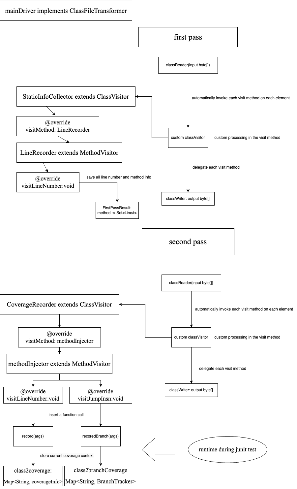

## Two-pass code coverage tool based on asm library.
### Solution overview
+ assumption: line coverage, one statement per line
+ first pass: parse the main class file with ASM event-based API, record the line numbers in source file with each method in a internal mapping structure.
+ second pass: modify the class file, insert a information-collecting method invocation for each source code line and each branch.
use java agent to apply the transformation when loading into virtual machine.



### Set up (maven)
1. Build the artifact: test-coverage-asm.jar
2. Copy test-coverage-asm.jar to somewhere in your project directory
3. Add into your project pom file two dependencies:
``` xml
<dependency>
    <groupId>org.ow2.asm</groupId>
    <artifactId>asm</artifactId>
    <version>9.4</version>
    <scope>compile</scope>
</dependency>
<dependency>
    <groupId>coverageASM</groupId>
	<artifactId>test-coverage-asm</artifactId>
	<version>1.0-SNAPSHOT</version>
	<scope>system</scope>
	<systemPath>{path to test-coverage-asm.jar}</systemPath>
</dependency>
```
4. Run junit test with following virtual machine arguments:
```shell
-javaagent:<path-to-test-coverage-asm.jar>=<your project name>
```
5. Coverage information are printed to standard output.

### Current issue
1. asm operate on class file, so there might be code lines that added by java compiler and not exist in original source file like:
```java
return void;
```
2. Invocation instruction of super class constructor/method is calculated towards current class.

